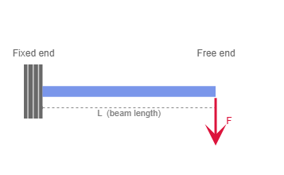

# Micro-Actuator Formula Visualizer

A beginner-friendly Streamlit app for visualizing cantilever beam tip
deflection in MEMS micro-actuators.


---

## English

### Try It Online

👉 **[Launch App](https://micro-actuator-formula-visualizer.streamlit.app/)**

No installation, no Python setup, and no command line required. Just open
the link in your browser and start exploring.

### Overview

This app helps beginners understand the most fundamental formula in
micro-actuator design: **how much does a cantilever beam bend** when you
push on it?

Enter beam dimensions, choose a material stiffness, and set the applied
force — the tip deflection updates instantly on an interactive chart.
No prior MEMS knowledge needed. If you understand high-school physics,
you are ready.

**The current version (v0.1) covers only cantilever beam tip deflection.**
More modules are planned for future releases.

### Features

- Direct numeric input for 5 physical parameters
- Real-time deflection calculation
- Automatic SI unit conversion (inputs in μm, μN, GPa; calculation in m, N, Pa)
- Force vs. tip deflection Plotly line chart
- Cantilever beam schematic diagram (fixed end, free end, applied force)
- LaTeX-rendered formula display
- Symbol reference table with units
- English / Chinese language switching
- Manual validation with translated error messages

### Formula

Cantilever beam tip deflection under a point load at the free end:

```
δ = F · L³ / (3 · E · I)
```

The moment of inertia for a rectangular cross-section:

```
I = w · t³ / 12
```

| Symbol | Meaning | Unit |
|---|---|---|
| δ | Tip deflection | μm |
| F | Applied force | μN |
| L | Beam length | μm |
| w | Beam width | μm |
| t | Beam thickness | μm |
| E | Young's modulus | GPa |
| I | Moment of inertia | m⁴ (SI) / μm⁴ (MEMS-scale) |

All calculations use SI units internally. Input values in μm, GPa, and
μN are converted automatically. The moment of inertia is computed in m⁴
but also shown in μm⁴ for an intuitive MEMS-scale reading.

### Run Locally for Developers

```bash
git clone https://github.com/r4uze/micro-actuator-formula-visualizer.git
cd micro-actuator-formula-visualizer
pip install -r requirements.txt
streamlit run app.py
```

Then open **http://localhost:8501** in your browser.

### Project Structure

```
micro-actuator-formula-visualizer/
├── app.py               # Main application
├── requirements.txt     # Python dependencies
├── locales/             # Translations (en.json, zh-CN.json)
├── assets/              # Screenshots and diagrams
│   └── README.md
└── README.md            # You are here
```

Everything is in `app.py` — a single file you can read and modify in
one sitting.

### Screenshot



*If the image above does not appear, add a screenshot file named
`screenshot.png` to the `assets/` folder. Recommended size:
1200 × 700 px.*

### Model Assumptions

- **Rectangular cross-section** — the beam has a uniform rectangular profile.
- **Small deformation** — deflection is small relative to beam length.
- **Linear elastic behavior** — material obeys Hooke's law, no plastic deformation.

### Limitations

This is a simplified educational model and is **not a replacement for
Finite Element Method (FEM) simulation**. It does **not** account for:

- Nonlinear deformation (large-deflection effects)
- Damping (viscous or structural)
- Dynamic response
- Resonance
- Time-dependent loading

### Roadmap

The current version (v0.1) covers only cantilever beam tip deflection.
Planned modules for future releases:

| Module | Description |
|---|---|
| Beam stiffness | Spring constant k = F / δ |
| Resonant frequency | Natural frequency of micro-beams |
| Material presets | Quick-select common MEMS materials |
| Piezoelectric actuation | Piezoelectric extension and force |
| Magnetic micro-actuation | Lorentz force and magnetic torque |

Contributions and ideas are welcome.

### Author

Created by **r4uze**.

---

## 中文说明

### 在线使用

👉 **[打开应用](https://micro-actuator-formula-visualizer.streamlit.app/)**

无需安装 Python，无需下载 Git，无需使用 VS Code，也无需命令行。
普通用户可以直接在浏览器中打开使用。

### 项目简介

本应用帮助初学者理解微执行器设计中最基础的公式：
**悬臂梁在受力时会产生多大的挠度？**

输入梁的尺寸、材料刚度和施加力，交互式图表会实时显示挠度变化。
不需要 MEMS 背景知识，只要具备高中物理基础即可轻松上手。

**当前版本（v0.1）仅包含悬臂梁尖端挠度模块。** 更多模块计划在
后续版本中添加。

### 功能特点

- 5 个物理参数的数字输入
- 实时挠度计算
- 自动 SI 单位转换（输入单位：μm、μN、GPa，内部计算：m、N、Pa）
- 施加力与末端位移关系 Plotly 折线图
- 悬臂梁示意图（固定端、自由端、施加力）
- LaTeX 渲染公式显示
- 符号含义与单位对照表
- 中文 / 英文语言切换
- 带翻译的输入范围错误提示

### 公式说明

悬臂梁在自由端受到集中力时的尖端挠度：

```
δ = F · L³ / (3 · E · I)
```

矩形截面的截面二次矩：

```
I = w · t³ / 12
```

| 符号 | 含义 | 单位 |
|---|---|---|
| δ | 尖端挠度 | μm |
| F | 施加力 | μN |
| L | 梁长度 | μm |
| w | 梁宽度 | μm |
| t | 梁厚度 | μm |
| E | 杨氏模量 | GPa |
| I | 截面二次矩 | m⁴（SI）/ μm⁴（MEMS 尺度） |

所有计算均使用国际单位制（SI），输入的 μm、GPa、μN 会自动转换。
截面二次矩 I 在内部使用 m⁴ 计算，同时以 μm⁴ 显示以便于直观理解
MEMS 尺度。

### 开发者本地运行

```bash
git clone https://github.com/r4uze/micro-actuator-formula-visualizer.git
cd micro-actuator-formula-visualizer
pip install -r requirements.txt
streamlit run app.py
```

在浏览器中打开 **http://localhost:8501**。

### 项目结构

```
micro-actuator-formula-visualizer/
├── app.py               # 主程序
├── requirements.txt     # Python 依赖
├── locales/             # 翻译文件（en.json、zh-CN.json）
├── assets/              # 截图与示意图
│   └── README.md
└── README.md            # 项目说明
```

所有代码集中在 `app.py` 这一个文件中，方便初学者阅读和修改。

### 项目截图


*如果上方图片无法显示，请在 `assets/` 文件夹中添加名为
`screenshot.png` 的截图文件。建议尺寸：1200 × 700 像素。*

### 模型假设

- **矩形截面** —— 梁具有均匀矩形轮廓。
- **小变形** —— 挠度相对于梁长度很小。
- **线弹性行为** —— 材料遵循胡克定律，无塑性变形。

### 模型局限

本项目是一个简化教学模型，**不能替代有限元法（FEM）仿真**。
**不包含**以下内容：

- 非线性变形（大挠度效应）
- 阻尼（粘性阻尼或结构阻尼）
- 动态响应
- 谐振
- 随时间变化的载荷

### 后续计划

当前版本（v0.1）仅包含悬臂梁尖端挠度模块。后续版本计划添加：

| 模块 | 说明 |
|---|---|
| 梁刚度 | 弹簧常数 k = F / δ |
| 谐振频率 | 微梁的固有频率 |
| 材料预设 | 快速选择常用 MEMS 材料 |
| 压电驱动 | 压电伸缩与驱动力 |
| 磁微驱动 | 洛伦兹力与磁力矩 |

欢迎贡献代码和提出建议。

### 作者

本项目由 **r4uze** 创建。
